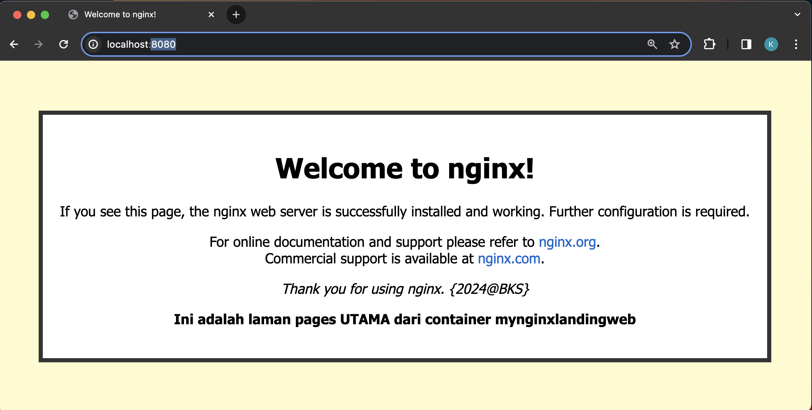
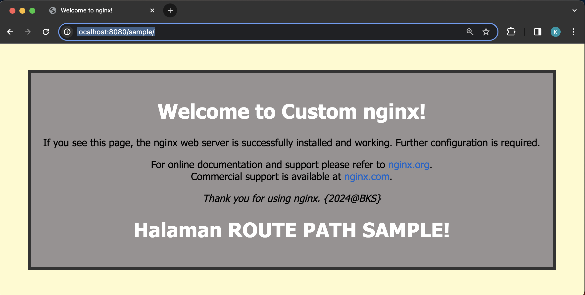

    

---

## Notes

	❯ docker build -t nginx-path-sample .
	
	❯ docker run -d --name mynginxlandingweb -p 8080:8080 nginx-path-sample

---

	❯ docker images

		REPOSITORY          TAG       IMAGE ID       CREATED         SIZE
		nginx-path-sample   latest    cf23ae21c6a4   8 seconds ago   192MB

	❯ docker ps -a

		CONTAINER ID   IMAGE               COMMAND                  CREATED         STATUS         PORTS                            NAMES
		4f166ed0dde8   nginx-path-sample   "/docker-entrypoint.…"   4 seconds ago   Up 3 seconds   80/tcp, 0.0.0.0:8080->8080/tcp   mynginxlandingweb

----

    

    

